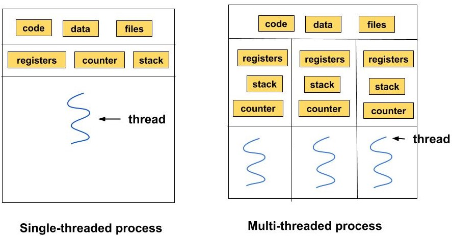

# Concurrency 

## Introduction to process & Threads

### Important concepts

- Process is program in execution( running program)
- Speed of CPU >>> Speed of Hard-disk
- RAM size <<< HDD/SSD size
- Perform depends on RAM & no. of CPU core

### Internal working

- when we load/launch the application, os allocates this application into RAM
- once this application is running in RAM it becomes process (running state)
- Then CPU executes this process
- The Process contains multiple threads along with application code, resources & other files related to application
  - Example: lets say we have launched Microsoft word application, first OS loads the application into RAM, then this becomes a process
  - Inside this process, there are multiple other small processes are running in parallel such as
    - spell checker
    - auto suggestion 
    - Grammar check
  - This internally processes which are running in parallel within process is called _Thread_
- Thread is a light weight process which runs/executes inside a process along with other application resources
- In general, thread is a unit of CPU execution

### Structure of Process (Process Control Block)

- The Process consists of 
  - application code
  - application data
  - resources
  - program counter(PC)
  - stack
  - Thread
- There can be multiple threads within a single process; each thread has their own PC, stack, data
- Whereas the application code is commonly used.

### Process Vs Threads

| Process                                   |  | Thread                                  |
|-------------------------------------------|----------|-----------------------------------------|
| Processes may not share data between them |    | All Threads can share common data       |
| Process takes more memory & speed is less |    | Thread takes less memory & speed is fast |

### Concurrency Vs Parallelism
| Concurrency                                                  |  | Parallelism                                                                                       |
|--------------------------------------------------------------|----------|---------------------------------------------------------------------------------------------------|
| At a given point of time, only one thread is making progress |    | Multiple threads running in parallel, concecurrey + Multiple threads making progress at same time |

## How Production services handle threads

- In real production thread is handled by service called Executors service
- A service that helps to manage threads in code more efficiently
- Efficiently manages multiple threads
- Executors use _Thread pool_ to handle threads & also destroy them if not utilized through garbage collector
- We can also reuse same threads again after its done with execution so that we don't end up creating N no.of threads
- Through the concept of Thread-Pool, executors service runs the certain no. of thread parallelly & remaining are waited in waiting queue, as soon as one of the running thread is done with execution the next thread from waiting queue is processed

## Understanding Executor service

- Executor service consists of 
  - work queue : the size of work queue describes how many are in waiting state
  - Workers : No. of tasks
- lets take an example, say we have 100 tasks & created a thread pool size of 10 threads
- At a time 10 threads are available for completing 100 tasks
- say at time = 95, then 94 tasks are totally in execution, out of which 10 threads ( size of pool ) will be assigned
- The Remaining 84 tasks are in work-queue
- At the end, make sure you shutdown executor service

## Callable Interface

- Similar to Runnable interface, however, the only difference is has a return type
- It can return any data-type
- Used when we have to implement task & return some data